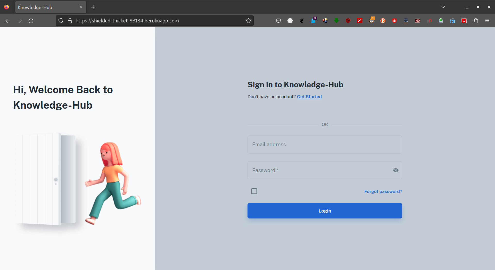
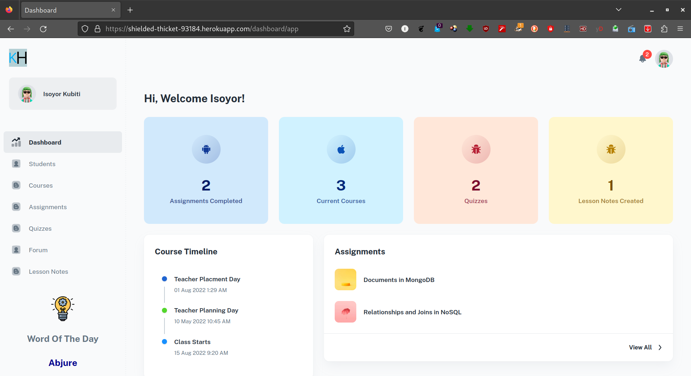
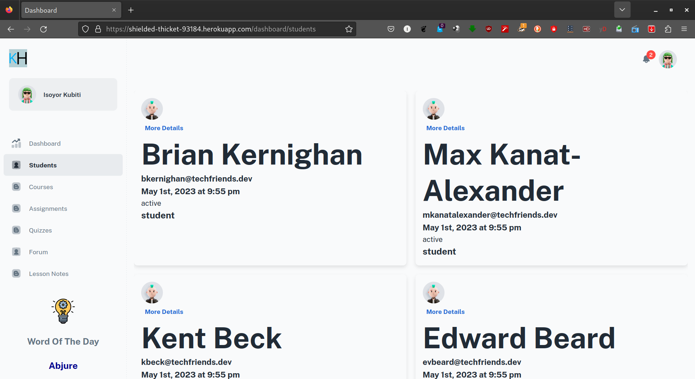
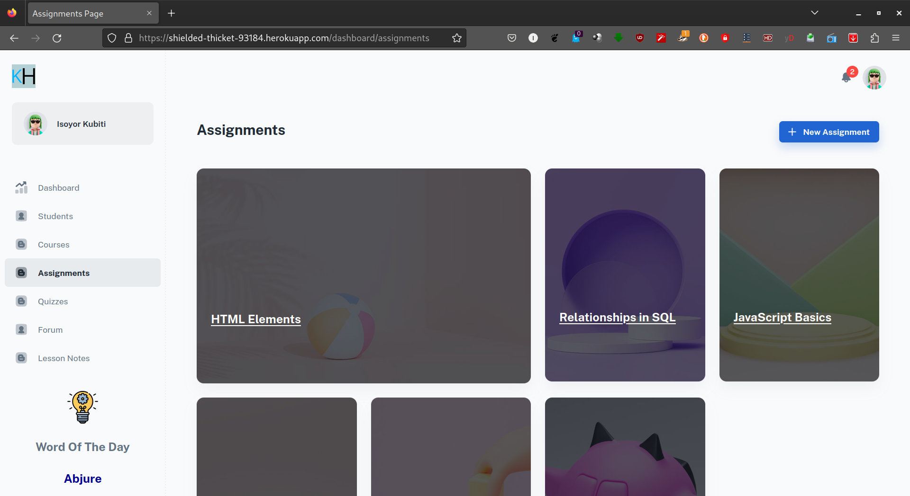
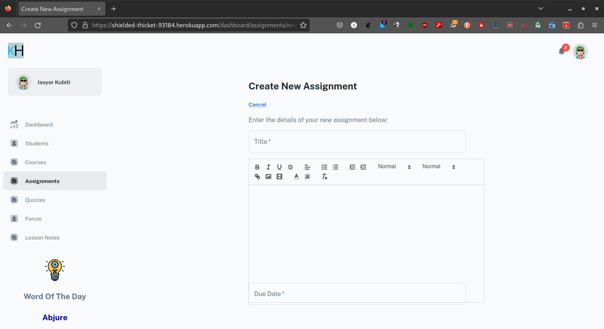
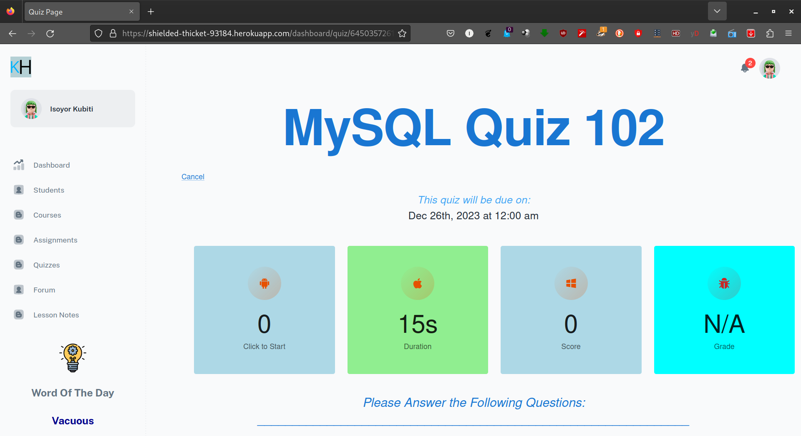
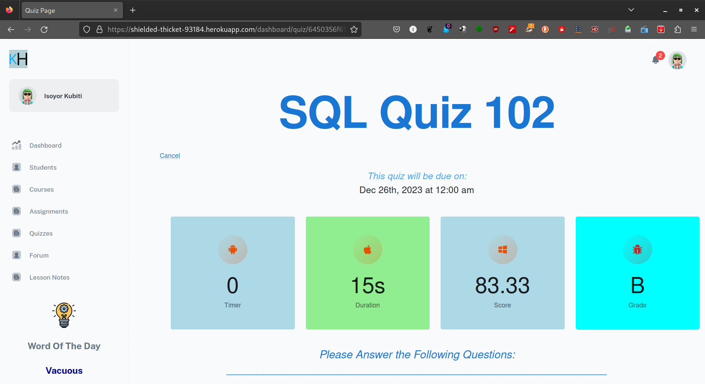

# Knowledge Hub

## Description

A learning management system that provides a centralized platform for educators to create course materials. The app could include features such as digital course creation tools, quizzes and assessments, and progress tracking.

## Table of Contents:

- [Usage](#usage)
- [Contributions](#contributions)
- [Links](#links)
- [Published Page](#page)
- [Repo](#repo)

## Usage

AS AN educator
I am always looking for more ways to broaden my class experience
I WANT an easy way to create online course materials
AND discover new ways for my classes to interact with course material
SO I can create a more interactive experience for my students

## Contributions

Austin McClarren [Github](https://github.com/AustinMcClarren)

Chris Girard [Github](https://github.com/ChrisEliGirard)

Isoyor Kubiti [Github](https://github.com/ikubiti)

Zeus Cordeiro [Github](https://github.com/Zcordeiro)

## Screen Shot

- The landing page presented to the user on visiting the page.

- The Login page for a returning user.

- The Registration page for a new user.

- On successfully logging in, the user is taken to their dashboard page

- A teacher view of the students page. 

- The assignments page for all users.

- This page presents the page for a teacher to create new assignments.

A new quiz page presented to a user

The graded quiz page for a completed quiz

# LINKS

## Link to Deployed Page

[Link to Deployed Site](https://shielded-thicket-93184.herokuapp.com/)

## Repo

[Link To Github Repo](https://github.com/TheMernMachine/Knowledge-Hub)
